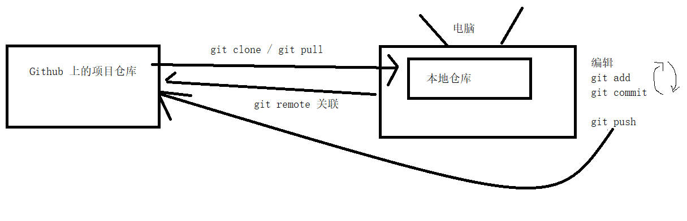
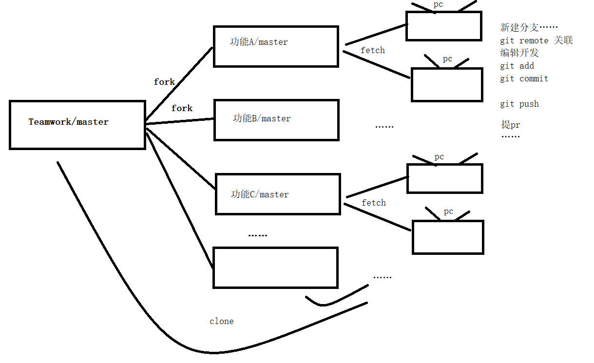

# Git

> 版本控制工具


# 基本 Git命令

```git
git init
git add
git commit
git fetch
git merge
git pull
git push
git status
git log
git remote
git branch
git switch
git restore
git reset
```


## git init

```git init``` 即初始化，对项目文件夹进行初始化，生成默认隐藏的 ```.git``` 文件夹。该文件内记录了在项目文件夹内所有的操作信息。


## git add

```git add``` 可将**工作区**的指定内容，添加到**暂存区**。我们常用 ```git add .```  其作用是将工作区的所有内容（已经  ```.gitignore``` 文件中声明的除外）全部添加到暂存区。


> 工作区：直接地理解，就是在项目文件夹内，我们能看见的所有文件都是在工作区。
>
> 暂存区：是不能直接观察到的，一般地需要使用 ```git add``` 命令将文件从**工作区**添加到**暂存区**，暂存区才会有内容。

---

 ```.gitignore``` 文件，需要手动创建。一般地我们会模仿优秀项目的  ```.gitignore``` 文件，防止不必要上传的文件（诸如密码、令牌、权限等信息的文件）泄露。有了该文件，我们就可以放心地使用```git add .``` 


## git commit

```git commit``` 可将**暂存区**的所有内容，提交到**本地仓库/本地版本库**。一般地我们会使用 ```git commit -m "描述信息 by English"```，可本次提交添加描述信息。

> 本地仓库/本地版本库：一般来说，当一些比较大的修改完成，我们会使用`git commit`命令完整记录这次修改，每次commit被称作一个版本，因此将存储这些commit的仓库叫做版本库。


## git fetch

从**远程仓库**拉取最新版本，并**保存在本地**，不会自动合并。


## git merge

```git merge <目标 branch>``` 将目标分支合并到当前所在分支。


## git pull

从**远程仓库**拉取最新版本，并与本地仓库**自动合并**更新。相当于执行了 ```git fetch 和 git merge```。


## git push

将**本地**推送到**远程仓库**。使用```git push -u <本地分支> <远程分支> ```命令，可以将本地分支与上游分支（upstream）关联。


## git status

查看 **工作区**、**暂存区**、**本地仓库** 的状态。


## git log

打印 commit 日志，该日志记录了 每一次 commit 版本。其结果可作为版本 **回退** 和 **处理冲突** 等参考信息。


## git remote

```git remote  add <可自定义本地仓库名称> <远程仓库地址> ``` 将本地仓库和远程仓库关联。

使用 ```git remote -V``` ，可查看关联信息。


## git branch

```git branch -c <分支名>```创建分支。


## git switch

切换分支。目前处于 分支 **branch_A** ,要从 **branch_A** --> **branch_B** ,使用 ```git switch branch_B```


## git restore

进行版本回退


## git reset

版本重置到指定版本，并删除当前版本到指定版本之间的历史版本。


## 个人开发

```git ``` 和 代码托管平台```Github``` 配合使用，将打开新世界。简单说下 ```Github```，世界上最大的程序员交流社区，十分好用的代码托管平台。我们可以将代码上传到 ```Github```,有点网盘的云端存储的意思，将代码保存到云端，随用随取，以方便合作开发。

对于```Github```上的项目有两种身份，维护者（Maintainer）和贡献者（Contributor）。

个人开发，作为项目的拥有者，我们自然是属于维护者（Maintainer），对项目有着最高的管理权限。

在个人开发中，我们常用的操作有：

```git
# 在 Github上创建好项目仓库
# 配置好 ssh key，保证本地与 Github的连接
git pull <项目ssh链接> 或 git clone <项目ssh链接> # 获取远程仓库的最新版本
git remote add <自定义的本地仓库名> <项目ssh链接> # 将本地仓库与远程仓库关联
git remote —v # 查看关联结果
# 接下来可以修改、编辑文件
# git add/commit ……
git push  # 将本地仓库上传到远程仓库
git push -u <本地分支> <远程分支> # 新建远程分支/为本地分支关联远程分支
# 本地编辑 -> git add . -> git commit -m "" -> git push -> 本地编辑 -> ……，根据情况，执行必要操作
```




## 合作开发



合作开发时，一般团队项目只有一个master分支。除了少数人对该项目具有**维护者**权限，大多数成员只能作为项目的**贡献者**进行开发。

贡献者之中也是围绕个别人进行工作，所以由其中的领导者将 **Teamwork**```fork```到自己的 ```Github```仓库中，从而成为所谓 **Teamwork-副本**项目的**维护者**，从而获取 ```push```权限。而剩下的贡献者就是**Teamwork-副本**项目的**贡献者**。

维护者审查 push 和 pr ，合并到 **Teamwork**中，实现团队合作共同开发。