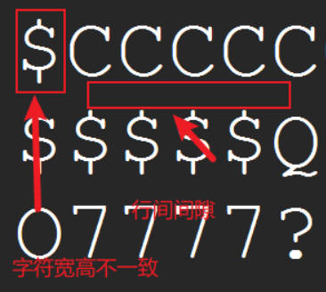
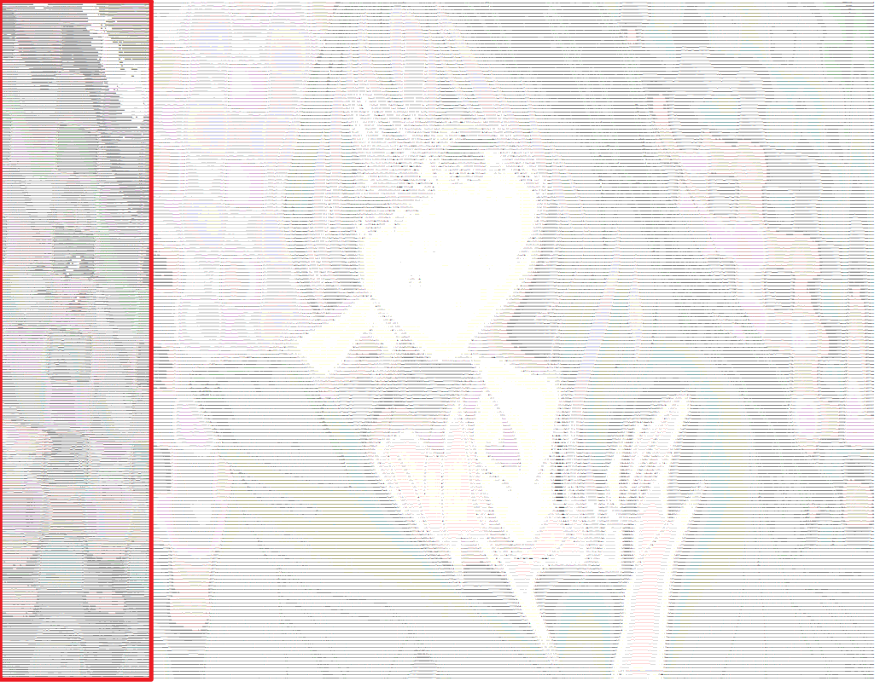

# 字符画

> 属实是”考古“了


## 基本原理

- 图像是由一个个 **像素**排列而成

- 像素值 `0 ~ 255`，值越高（趋近255）则越亮，反之越低（趋近0）则越暗

- 彩色图片一般有3个颜色通道：R（红）、G（绿）、B(蓝)

- 灰度图是单通道，可由3通道映射得到，如`gray = 0.2126 * r + 0.7152 * g + 0.0722 * b`

- 通过字符线条的密集程度不同可以进行明暗区分，即灰度值区分

    
  
- 字符可以看成比较大块的像素，通过数学计算可使得 **字符** 与 **像素值分区** 建立联系

综上，以字符代替像素 “**重组**” 图片，可实现字符成画


## 字符图画

### 目标 #1

- **input** :	大小适中的图片 (1280 × 720)

- **output**：文本文件 `.txt`


### 实现思路

> 简言之，像素映射到字符上

- 初始化必要信息，包括但不限于 相关文件输入输出**路径**、**字符序列**
- 预处理，如**提取**灰度图、调整**尺寸**
- 计算像素转换字符，如序列中各字符对应各自的像素值区间、文字填充
- 保存，将转换后的字符流保存到文件中


### 具体实现

#### 工具库

```python
from PIL import Image # 必要
import numpy as np # 可选
```


#### 字符序列

> 两者取其一

- “**彩色**”

```python
chars = list("MNHQ$OC?7>!:-; ")
```

- **黑白**

```python
chars = list(
    '"$%_&WM#*oahkbdpqwmZO0QLCJUYXzcvunxrjft/\|()1{}[]?-/+@<>i!;:,\^`.')
```

共用

```python
# 索引值
len = len(chars) - 1 
```

> 个人比较喜欢 彩色序列


#### 主要方法

```python
def main():
    # 初始化参数
    img_path = "./data/"
    out_path = "./frame/"
    img_name = "in.jpg"
    out_name = "out.txt"

    # 【1】获取图像 convert ("L")/("RGB") ? _gray : _RGB
    img = Image.open(img_path + img_name).convert("L")
    # 【2】调整尺寸
    width, height = img.size # 原尺寸
    ratio = 0.8 # 比率
    width = int(width*ratio)
    height = int(height*ratio)
    img = img.resize((width, height),Image.LANCZOS)
    # 【3】获取像素矩阵
    pixels = np.array(img)  # 生成img的copy数组pixels
    # 容器
    result = ""
    # 像素值转字符
    for h in range(height):
        for w in range(width):
            # 【4】计算像素对应字符索引
            index = pixels[h][w] // (256 // len)
            result += chars[index]  
        result += "\n"  # 添加换行符

    # 保存文本
    with open(out_path + out_name, "w", encoding="utf-8") as f:
        f.write(result)
```

> 【1】获取图像 convert ("L")/("RGB") ? _gray : _RGB
>
> - 提取灰度图：`.convert("L")`
> - 提取彩色图（三通道）：`.convert("RGB")`
>
> 【2】调整尺寸
>
> - 比率
>
> 	```python
> 	width, height = img.size # 原尺寸
> 	ratio = 0.8 # 比率
> 	width = int(width*ratio)
> 	height = int(height*ratio)
> 	img = img.resize((width, height),Image.LANCZOS)
> 	```
>
> - 自定义
>
>   ```python
>   width, height  = 1024, 460 # 100,40
>   img = img.resize((width, height))
>   ```
>
> - 微调 - 放宽率
>
>   调整像素后，由于`.txt `中**行间距**的干扰，所以实际表现并不理想
>
> 	```python
> 	widen = 1.8 # 放宽率
> 	width = int(width * widen) 
> 	```
>
> 【3】获取像素矩阵
>
> ```python
> # 视计算像素对应字符的方法决定，若未用到 numpy库，则可注释掉
> pixels = np.array(img)  # 生成img的copy数组pixels
> ```
>
> 【4】计算像素对应字符索引（3种）
>
> - 方法一
>
>   ```python
>   # 前提 1：提取灰度图
>   img = Image.open(img_path + img_name).convert("RGB")
>   # 前提 2：导入 numpy
>   pixels = np.array(img)
>
>   ……
>
>   index = pixels[h][w] // (256 // len)
>   ```
>
> - 方法二
>
>   ```python
>   # 前提 1：提取彩色图
>   img = Image.open(img_path + img_name).convert("RGB")
>   # 前提 2：导入 numpy
>   pixels = np.array(img)
>
>   ……
>
>   # 运行时，以下三通道取其一
>   index = pixels[h][w][0] // (256 // len)
>   index = pixels[h][w][1] // (256 // len)
>   index = pixels[h][w][2] // (256 // len)
>   ```
>
> - 方法三
>
>   ```python
>   # 前提 ：提取彩色图 或 不提取
>   img = Image.open(img_path + img_name).convert("RGB")
>   img = Image.open(img_path + img_name)
>                             
>   ……
>                             
>   # 获取通道值
>   r, g, b = img.getpixel((w,h)) 
>   # 根据灰度值公式，将像素的 RGB 值映射到灰度值
>   index =  int(0.2126 * r + 0.7152 * g + 0.0722 * b) // (256 // len)
>   ```
>


#### 执行入口

```python
if __name__ == "__main__":
    main()
    print("已完成")
```


### 小结

**字符序列**

- 短序列 `MNHQ$OC?7>!:-; `
- 长序列 `"$%_&WM#*oahkbdpqwmZO0QLCJUYXzcvunxrjft/\|()1{}[]?-/+@<>i!;:,\^`.`

> 个人比较倾向 短序列，其体验比较好

**调整尺寸**

- 比率
- 自定义
- 微调 - 放宽率

> 如何调整具体情况具体分析，但值得肯定是无论比率还是自定义，再配合上微调放宽率最后的结果都还挺不错的

**提取灰度图**

- 设置`convert`提取模式
- 数学公式 [standard luminance measure for RGB](http://en.wikipedia.org/wiki/Luminance_(relative))

**字体**

> 踩坑

- 问题：图片按行扫描，每行转换出的字符数量自然是一样的。但为何 **记事本** 打开，行与行的长短十分“自由”
- 解决：**字体** 从 **微软雅黑** 改成 **宋体**
- 结论：根本原因是 **字体特点** 上，有的字体大小不一

**文本**

- 输出结果以 `.txt`格式保存存在**限制**，即**每行最多 1025列**，超出会强制换行。其**结果**就是图像**最右**部分与最左部分**重叠**形成**干扰**。



- 黑白字符存在上限，至多算 **伪**彩色


------


### 目标 #2

- **input** :	大小适中的图片 (1280 × 720)

- **output**：图像 `.png`


### 实现思路

> 简言之，将灰度图上得到的字符信息，写在画布上

- 初始化必要信息，包括但不限于 相关文件输入输出**路径**、**字符序列**
- 提取**灰度**图，调整**尺寸**并获取其**像素矩阵**（必须）
- 提取**RGB**图，调整**尺寸**并获取其**像素矩阵**（可选）
- 从灰度图中，转出对应字符信息
- 创建画布，将字符信息写到图上
- 保存图片到本地


### 实现代码

> 以彩色字符画为例

```python
from PIL import Image, ImageDraw, ImageFont
import numpy as np

# 字符序列
chars = list("MNHQ$OC?7>!:-; ")
length = len(chars) - 1

def main():
    # 初始化参数
    img_path = "./data/"
    out_path = "./frame/"
    img_name = "play.jpg"
    out_Txt = "test.txt"
    out_Pic = "out.png"

#  【1】获取灰度图像
    gray_img = Image.open(img_path + img_name).convert("L") 
    # 调整大小
    width, height = gray_img.size  # 原尺寸
    ratio = 0.4  # 比率
    width = int(width * ratio)
    height = int(height * ratio)
    gray_img = gray_img.resize((width, height))
    # 获取像素矩阵
    gray_pixels = np.array(gray_img)

#  【2】获取彩色图像
    color_img = Image.open(img_path + img_name).convert("RGB") 
    # 调整大小
    color_img = color_img.resize((width, height))
    # 获取像素矩阵
    color_pixels = np.array(color_img)

# 【3】灰度图中提取字符信息
    results = []  # 容器
    for h in range(height):
        line = ""
        for w in range(width):
            index = gray_pixels[h][w] // (256 // length)  
            line += chars[index]
        results.append(line)
        
# 【4】画图
    # 获取画笔和图层
    new_img = Image.new("RGBA",(len(results[0])*10,len(results)*10),(255,255,255))# 设置白底
    draw = ImageDraw.Draw(new_img)
    # 图上写字(默认白色字)
    for y in range(len(results)):
        for x in range(len(results[0])):
            # 提取颜色
            r,g,b = color_pixels[y,x]
            draw.text((x*10,y*10),results[y][x],fill=(r,g,b))
            # draw.text((x*10,y*10),results[y][x]) # 白色字，所以不要弄白底
    new_img.show() # 预览
    # 保存
    new_img.save(out_path + out_Pic)


if __name__ == "__main__":
    main()
    print("=== 完成 ===")
```

> 【1】、【2】、【3】不做赘述。
>
> **【4】画图**
>
> - 获取画笔和图层
>
>   ```python
>   new_img = Image.new("RGBA",(len(results[0])*10,len(results)*10),(255,255,255))
>   draw = ImageDraw.Draw(new_img)
>   ```
>
>   `Image.new( mode, size, color)`：模式 mode ，尺寸 size ， 底色 color（默认为黑色）
>
>   > **特别情况：当设置图片的 mode 为 ‘RGBA’ 时，如果不填 color 参数的话，图片是 透明底！**
>
>   长、宽放大 N倍：预留空间，防止写字符时出现因间隙太小而效果不好的问题
>
> - 图上写字
>
>   ```python
>   for y in range(len(results)):
>           for x in range(len(results[0])):
>               r,g,b = color_pixels[y,x]
>               draw.text((x*10,y*10),results[y][x],fill=(r,g,b))
>   ```
>
>   提取颜色：从彩色图中获取 **RGB值**，用于写字时色彩填充`fill = ……`。不填充默认白色，若画布为白底，结果可想而知。
>
>   方大 N倍：增加字符间隙，防止字符堆积影响出图的效果


### 小结

相比于 以**文本**形式输出保存的结果，以**图像**保存具有如下优势：

- 尺寸大小不受限：文本每行字符有上限超时强制换行，其结果”图像重叠“，图像则不会
- 支持多种颜色：同字符画中，文本的色彩保持一致，图像可以出现多种颜色

图像也有需要注意的地方：

- 创建画布要放大以预留空间
- 写字位置要放大以偏移
- 画布白底需谨慎

> 前两点都是针对字符堆积问题而提出，以此同时也会增加文件大小


## 文字填充

> 之前字符画的实现都是以提取字符信息为前提的，而文字填充则跳过该步骤。如此来看后者，可调侃声“不群 

### 代码实现

> 有之前的基础，这里直接上代码

```python
from PIL import Image, ImageDraw, ImageFont

# 生成彩色字符图画
def CharPic(text):
    # 获取图片基本信息
    img_path = "./data/play.jpg"  # 输入图片路径
    img = Image.open(img_path)
    w, h = img.size
    # 配置字体
    font_size = 10  # 字体大小，越小越细腻
    font_path = 'C:/Windows/Fonts/simhei.ttf'  # 本地黑体字体路径
    font = ImageFont.truetype(font_path, font_size)
    # 画图
    new_img = Image.new("RGBA", (w, h))
    draw = ImageDraw.Draw(new_img)
    num = 0
    for i in range(0, h, font_size):
        for j in range(0, w, font_size):
            r,g,b= img.getpixel((j, i))
            draw.text((j, i), text[num % len(text)], fill=(r, g, b), font=font)
            num += 1
    new_img.show()  # 预览
    # 保存
    new_img.save('./frame/out.png')

if __name__ == "__main__":
    CharPic("楚重")
```

何必仰人鼻息依傍字符序列？

何必小心谨慎调整尺寸？

何必分别甚清灰度RGB？

我自做我！

先丈量 `img.size`，

再磨墨 `font`，

继挥毫 `.text()`！

见画当知我！


### 小结

> 虽然没有使用字符序列，但是依然离不开 **基本原理** 。
>
> 字符者，大像素也。线条交错，有明暗，可成画矣

优点很明显啦，实现简单色彩饱满容错高，比较推荐


## 作业：字符动画

### 大体思路

> - 原视频抽帧到统一文件夹下备用
> - 所有帧按序加工成字符画新帧，并将新帧输出到新文件夹下备用
> - 读取所有字符画新帧文件，组合成新视频
> - 选择音频素材，合并音视频（可选）
> - 播放（可选）

### 实现代码

> 全自动，解放双手

```python
from PIL import Image, ImageDraw, ImageFont
import numpy as np
import cv2 as cv
import os

# 初始化
chars = list("MNHQ$OC?7>!:-; ")
length = len(chars) - 1
video_path = "./data/1.mp4" # 原始视频
frame_dir = "./frame/" # 原始视频 - 帧
new_frame_dir = "./newFrame/" # 新帧文件夹
# 被 os.listdir优化了
# startNo = 1 # 新帧起始序号 1 
# endNo = 2 # 新帧终止序号 3362
out = './data/out.mp4' # 新帧组成视频
music = "./data/1.m4a" # 拼接 音频的相对路径
video = "./data/video.mp4" # 合并后视频的相对路径

def play(out):
    os.system("start " + out)

def merge(out,music,video):
    os.system("ffmpeg -i "+ out +" -i "+ music +" -c:v copy -c:a aac -strict experimental "+ video)

def getVideo(new_frame_dir,out):
    # 视频合成器
    vc = cv.VideoCapture(video_path)
    img = Image.open(new_frame_dir+"1.jpg")
    w,h = img.size
    cap_fps = vc.get(5)
    fourcc = cv.VideoWriter.fourcc('m', 'p', '4', 'v')
    out = cv.VideoWriter(out, fourcc, cap_fps, (w,h))

    fileNames = os.listdir(new_frame_dir) # os.listdir()顺序无序，可改进
    fileNames.sort(key=lambda x:int(x[:-4]))#倒着数第四位'.'为分界线，按照‘.'左边的数字从小到大排序
    # print(fileNames)
    for file in fileNames:
        frame = cv.imread(new_frame_dir + str(file))
        out.write(frame)
        # cv .imshow('video',frame)
        # if cv.waitKey(1) & 0xff == 27: 
        #     break   
    out.release()
    # cv.destroyAllWindows()

def transformer(frame_dir):
    fileNames = os.listdir(frame_dir)
    print(len(fileNames))
    for file in fileNames:
        # 获取灰度图像
        gray_img = Image.open(frame_dir+str(file)).convert("L")
        width, height = gray_img.size
        ratio = 0.4
        width = int(width * ratio)
        height = int(height * ratio)
        gray_img = gray_img.resize((width, height))
        gray_pixels = np.array(gray_img)
        # 获取彩色图像
        color_img = Image.open(frame_dir+str(file)).convert("RGB")
        color_img = color_img.resize((width, height))
        color_pixels = np.array(color_img)

        results = []
        for h in range(height):
            line = ""
            for w in range(width):
                index = gray_pixels[h][w] // (256 // length)
                line += chars[index]
            results.append(line)

        new_img = Image.new(
            "RGB", (len(results[0])*10, len(results)*10), (255, 255, 255))
        draw = ImageDraw.Draw(new_img)

        for y in range(len(results)):
            for x in range(len(results[0])):
                r, g, b = color_pixels[y, x]
                draw.text(
                    (x*10, y*10), results[y][x], fill=(r, g, b))
        new_img.save(new_frame_dir + str(file))
        print(">>>>>>>>> No: " + str(file) + " is saved ")

def getFrames(video_path,frame_dir):
    i = 0 
    vc = cv.VideoCapture(video_path)
    if vc.isOpened():
        open, frame = vc.read()
    else:
        open = False
        print('文件发生错误，请检查文件')
    while open:
        ret, frame = vc.read()
        if frame is None:
            break
        if ret == True:
            i = i+1
            cv.imwrite(frame_dir + str(i) +".jpg",frame) #  保存帧
    vc.release()

if __name__ == "__main__":
    # 获取原始帧
    getFrames(video_path,frame_dir)
    print("=== 【获取原始帧】完成 ===")
    # 转化为新帧 transformer(frame_dir,startNo,endNo)
    transformer(frame_dir)
    print("=== 【转化为新帧】完成 ===")
    # 帧-帧融合
    getVideo(new_frame_dir,out)
    print("=== 【帧-帧融合】完成 ===")
    # 融合音频
    merge(out,music,video)
    print("=== 【融合音频】完成 ===")
    # 播放
    play(out)
    print("=== 谢谢 ===")
```

### 小结

> 以作业的形式将前面的内容组合起来，一方面可检验字符画的掌握情况，另一方面可促进思考。

本作业实现流程：视频抽帧 —> 按帧成画 —> 画合视频 —> 音视合并 —> 播放展示。

```
- 原视频 
  - 时长：13秒
  - 大小：306KB  
- 抽取总帧数：403 
  - 合计大小：30.6MB
- 字符画总数：403
  - 合计大小：1.34GB
- 新视频 
  - 时长：13秒 
  - 大小：452MB
```

显而易见地，前三部分可合成一部分。即在读取原始视频时就将读取到的帧加工成字符画，同时将其写入到新视频中。若是如此，那么就要求新视频和原始视频中帧的**尺寸一致**，也表明在加工帧成字符画中预处理时不能修改图像尺寸。考虑到字符画成品出来的实际效果，画时我们往往会将画布放大以预留空间和离散像素坐标以增加字符间隙，而这就意味着字符画常常和原图的尺寸并不一致。所以三步合一有利有弊。利在节省存储空间和转换可一步到位，弊在画面效果不理想。


## 思考

黑白/彩色字符画的差异？

> 答：黑白字符画的载体可以是文本文件，也可以是图片。因为图像本身、显示器状态、使用的字符序列等因素影响，黑白字符画可以出现 **伪**彩色，即远观多彩放大黑白。彩色字符画一定是以图片为载体，字符序列之于它仅仅是划分明暗，真正决定了色彩的是画上字符其底层的像素值，同色则可或深或浅即**色深**，异色则可包含不同RGB信息。由此来看，字符的色深（浅or深）是否保持一致也是两种字符画的差异所在。

如何实现彩色？

> 答：从图中传出字符信息，最后结果以图片形式保存。以此为前提，正常操作就行。

真的实现彩色了吗？

> 答：我想的彩色是指三种即以上的多种色彩同时出现在同一字符画中，所以黑白字符画但是用蓝色字就不是我想要实现的彩色。以此基准，来回答此问。通过放大**目标 #2**的结果，可见确实存在不同颜色，远看画面也比较细腻，但是当看到**文字填充**的结果后，与之相比前者的效果就不够看了，这也是我产生此疑问的来由。实践出真知，换个对比感强的图片，提升很明显，确实实现了彩色。都是彩色字符画，但目前发现细腻和颜色不可兼得。

字符动画如何实现全自动？

> 答：按照五部流程，仅在**按帧成画**时需要预知总帧数，优化此处即可实现全自动。于是使用 `os.listdir()` 替代 `for i in range(startNo,endNo)`，但因其具有**无序读取**的特点进而会导致最终合成的视频出现**乱帧**。于是需要作出如下调整：
>
> ```python
>fileNames = os.listdir(new_frame_dir)
> fileNames.sort(key=lambda x:int(x[:-4]))#倒着数第四位'.'为分界线，按照‘.'左边的数字从小到大排序
> ```

字符序列在实现彩色字符画中重要吗？ 到底要不要离散字符？

> 答：先回答第一个问题，事实上字符序列在彩色字符画中是 **充分但不必要**。其实原因很简单，因为每一个字符的笔画只占整个字符面积的一小部分，在彩色字符画中用字符间隙划分明暗，所有字符对于整个图片的亮度和颜色的贡献非常有限，不如色深和颜色来影响大。至于要不要离散，分两种情况进行考虑。若依然使用字符序列，建议离散字符增大间隙，这样的好处是字符画自然放大可见各字符，反之观察放大后产出的字符画上各字符无法辨别且像马赛克，效果很差。若使用简单字符串或汉字，建议不离散，好处是字符画更自然色彩饱满，反之离散后图画效果不好难以辨别。


## Reference

-  [standard luminance measure for RGB](http://en.wikipedia.org/wiki/Luminance_(relative)) 
-  [字符画——从入门到不屑](https://zhuanlan.zhihu.com/p/48941293?utm_id=0) 讲得挺不错，有兴趣可以看看
-  [Python 函数 sort()，sorted() 之区别及 key=lambda x:x[] 之理解](https://blog.csdn.net/iprobobo/article/details/122713695)
